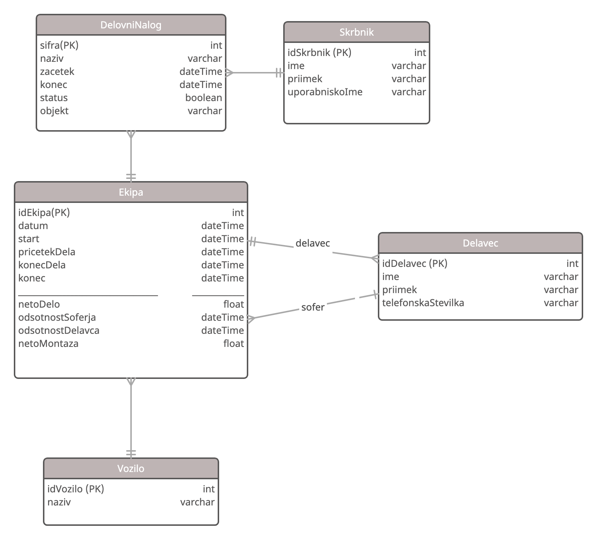

**Sestanek**

*21. 05. 2021*

1. Vprašanja za stranko
- Ali je potreben PDF izvoz posameznega delovnega naloga?
- ~~Potni nalog, delo, …?~~ 
- Ali je objekt enak delovnemu nalogu?
  - Če ne → ali je objekt vezan na ekipo ali na delovni nalog?
- Ali je možno enemu delovnemu nalogu dodati več objektov?
- Kakšen je pomen rdeče/zelene barve pri beleženju delovnega časa na mesečni ravni? 
- ~~Je urejanje vezano na skrbništvo?~~

2. Nasveti
- Ob vsaki spremembi hranimo vse podatke
- Ekipo in potni nalog (?) lahko združimo v eno entiteto

3. ER model

